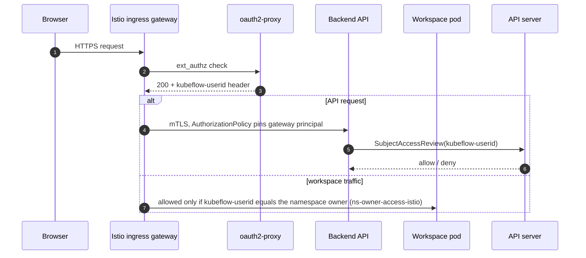
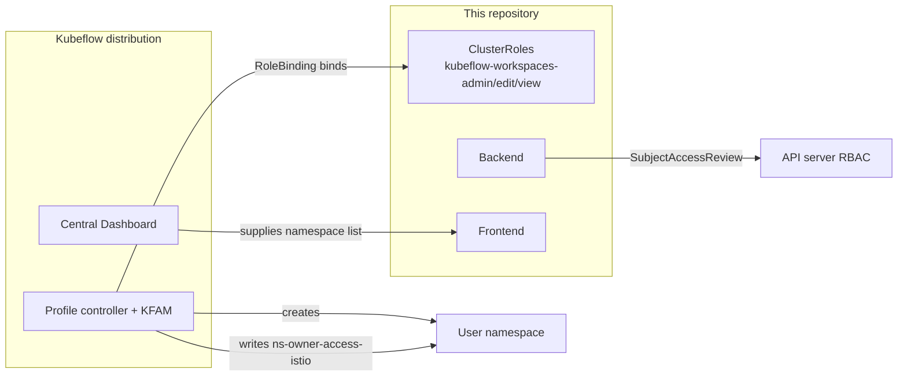
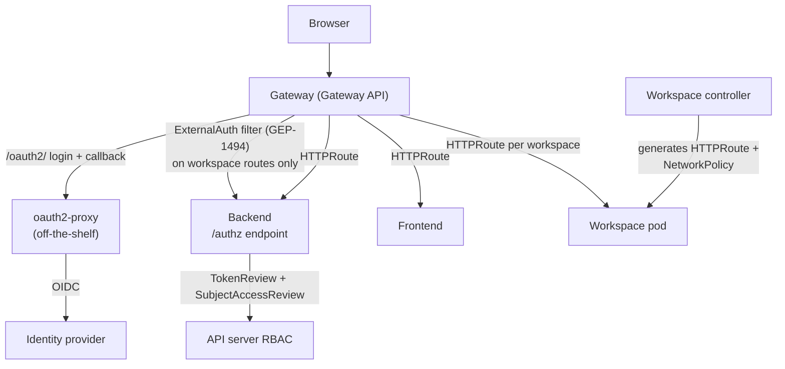

# Kubeflow Notebooks on Gateway API

## Authentication and Authorization without Istio

| Authors | [Antonio Ojea](mailto:aojea@google.com), [Siyuan Zhang](mailto:sizhang@google.com) |
| :---- | :---- |
| **Status** | Draft / Proposed — validated on GKE with Envoy Gateway (2026-09); see [Findings from a live deployment](#findings-from-a-live-deployment) |
| **Target** | `notebooks-v2` |
| **Related** | [GEP-1494](https://gateway-api.sigs.k8s.io/geps/gep-1494/), [Kubeflow Profiles](https://www.kubeflow.org/docs/components/central-dash/profiles/), [kubeflow/notebooks#1301](https://github.com/kubeflow/notebooks/pull/1301), [istio-replacement-evaluation.md](istio-replacement-evaluation.md), [user-guide-gke-envoy-gateway.md](user-guide-gke-envoy-gateway.md) |

## Summary

Kubeflow Notebooks v2 can already be deployed with Gateway API instead of Istio for **routing**. It cannot yet be deployed without Istio for **security**: several of the access controls it depends on are Istio resources created by the Kubeflow Profile controller, outside this repository.

The central observation is that **Kubeflow Notebooks never makes an authorization decision itself**. Every decision is delegated to the Kubernetes API server through `SubjectAccessReview`. Kubeflow Profiles write RBAC objects; they are not in the enforcement path. The coupling to Kubeflow is therefore much shallower than it appears, and is concentrated almost entirely in **how a request's identity is established**.

This document catalogues the controls that exist today and proposes replacements built only on Kubernetes and Gateway API standards. The result is deliberately **not a "standalone mode"**: it is the Gateway API deployment made complete. A complete deployment runs the same way inside a full Kubeflow distribution or alone on a bare cluster — the difference is configuration values, not a mode.

Most of the proposal was implemented and validated on a live GKE cluster. That validation also showed where the proposal was too optimistic: the parts of Istio's job that are routing and reachability translate cleanly to Gateway API; the part that is *identity* does not, because the standard lacks the primitives Istio relies on. The details, the routes evaluated and their verdicts are in [istio-replacement-evaluation.md](istio-replacement-evaluation.md); this document records the findings that change the proposal in [Findings from a live deployment](#findings-from-a-live-deployment).

## Motivation

Maintainer feedback on the Gateway API routing work was that Notebooks should be deployable on its own, decoupled from the wider Kubeflow distribution. The answer proposed here is not a new product or mode — it is finishing the Gateway API deployment, whose security half was never carried over from Istio. Today a working deployment requires:

- Istio, for ingress and for the authorization policies that protect workspaces
- oauth2-proxy and an identity provider, wired in as an Istio `ext_authz` provider
- The Profile controller and [KFAM](https://github.com/kubeflow/dashboard/tree/main/components/access-management), to create namespaces, RoleBindings, and the per-namespace `AuthorizationPolicy` that binds a workspace to its owner
- The Central Dashboard, to supply the namespace list the UI shows

None of these live in this repository. A user who wants notebooks on Kubernetes must install the entire distribution to get them.

### Goals

- Make the Gateway API deployment complete: secure and operable on any conformant cluster, with or without the rest of the Kubeflow distribution.
- No modes: one deployment whose behaviour is set by configuration values. A full distribution and a minimal install run the same manifests and differ only in what they set.
- Preserve the existing Istio deployment unchanged and as the default; every change is additive.
- Keep authorization delegated to Kubernetes RBAC, so administrators use tools they already have.
- Make the security properties of each deployment explicit, rather than implied by whatever happens to be installed.
- Keep the new code maintainable: minimal, well-isolated changes to upstream-owned files.

### Non-goals

- Replacing Kubeflow Profiles for other Kubeflow components.
- Providing a general-purpose service mesh replacement.
- Encrypting east-west traffic. This is addressed as a prerequisite, not by this repository (see [What we lose](#what-we-lose)).
- Multi-cluster deployments.

## Current state

### The three layers

Access is governed at three independent layers. Confusing them is the main reason the coupling to Kubeflow is hard to reason about.

| Layer | Question answered | Implemented by |
| :---- | :---- | :---- |
| **Reachability** | Can this pod open a connection to that pod? | `NetworkPolicy` (CNI), or Istio `AuthorizationPolicy` (sidecar) |
| **Authentication** | Who is this caller? | oauth2-proxy + Istio `ext_authz`, then a trusted header |
| **Authorization** | May this identity perform this action? | `SubjectAccessReview` → API server RBAC |

Only the authentication layer is genuinely coupled to Kubeflow. Authorization is plain Kubernetes RBAC. Reachability is currently Istio-specific but has direct Kubernetes equivalents.

### Request path today (Istio)

Steps 1–3 establish identity. The `SubjectAccessReview` is the only authorization check for the API. For workspace traffic, the per-namespace `AuthorizationPolicy` *is* the authorization check: Istio comparing a header against the namespace owner.

### Control plane today

The RBAC coupling is a single dotted line: the `kubeflow-workspaces-{admin,edit,view}` ClusterRoles are defined in **this** repository; only the binding is Kubeflow's.

### How the backend authenticates and authorizes

**Authentication.** The backend extracts identity from the `kubeflow-userid` and `kubeflow-groups` headers with no verification of any kind. Anything that can reach the backend's port can assert any identity.

**Authorization.** Every handler issues a `SubjectAccessReview` for the asserted identity. The backend does **not** impersonate the user: it performs all Kubernetes work with its own ServiceAccount, whose ClusterRole is broad and cluster-wide.

Two consequences follow. First, the `SubjectAccessReview` is the only thing scoping a request — an attacker who spoofs the identity gains the backend ServiceAccount's permissions, which are considerably broader than any user's. Second, `SubjectAccessReview` **does not authenticate anything**: it takes a username as input and answers whether that name may act; it never verifies the name is real. The chain is only as strong as whoever asserted the identity.

### What the Gateway API port changed

The existing Gateway API work replaced `VirtualService` with `HTTPRoute` and added overlays for the controller, backend and frontend. The routing is complete; the security controls were not carried across.

| Control | Istio deployment | Gateway API deployment |
| :---- | :---- | :---- |
| Backend / frontend reachability | `AuthorizationPolicy` pinned to the gateway ServiceAccount, verified by mTLS | `NetworkPolicy` allowing the whole `kubeflow` namespace |
| Workspace pod reachability | `ns-owner-access-istio`, from the Profile controller | **nothing** |
| Identity at the edge | oauth2-proxy as `ext_authz` | **nothing** |

The second row is the most serious: any pod in the cluster — including another tenant's notebook, which by definition runs user-supplied code — can reach a workspace Service directly and obtain an unauthenticated session. This is a cross-tenant escape.

This was easy to miss because the local development environment never exercised authentication: the frontend injects the identity headers from `localStorage` in dev mode, so no one developing against Tilt traverses a real authentication path.

## Gap analysis

| # | Gap | Provided today by | Severity |
| :---- | :---- | :---- | :---- |
| 1 | No identity provider integration | Kubeflow oauth2-proxy + Istio `ext_authz` | Blocking |
| 2 | Workspace pods have no reachability control | Profile controller `ns-owner-access-istio` | **Critical** — cross-tenant |
| 3 | Backend reachability is namespace-granular | Istio mTLS `principals` | High |
| 4 | Identity header trusted unconditionally | Network path, enforced by Istio | High |
| 5 | No mechanism to create namespaces and RoleBindings | Profile controller + KFAM | Medium — admins can do this |
| 6 | Namespace list requires cluster-wide `list namespaces` | Central Dashboard supplied the list | Medium |
| 7 | No encryption in transit east-west | Istio mTLS | See [What we lose](#what-we-lose) |
| 8 | ~~Workspace Pods require a `default-editor` ServiceAccount that nothing creates~~ | ~~Profile controller~~ | Closed upstream by [#1311](https://github.com/kubeflow/notebooks/pull/1311): the controller creates a `ws-<name>` ServiceAccount per Workspace |

Gap 5 is usually assumed to be the hardest and is in fact the easiest: the ClusterRoles already ship here, so a deployment without Profiles needs ordinary RoleBindings — created by an administrator or GitOps — and nothing else.

Gap 8 was the opposite — easy to miss, and it stopped a Workspace from starting at all — until [#1311](https://github.com/kubeflow/notebooks/pull/1311) gave every Workspace its own controller-owned ServiceAccount, removing both the hardcoded `default-editor` name and the Profile dependency. It is kept in the table because the related discussion still applies: the webhook that binds Roles to a Workspace's ServiceAccount gates on a `SubjectAccessReview` that evaluates the backend rather than the caller, because the backend acts as its own ServiceAccount and does not impersonate. That is the confused deputy described in [Current state](#current-state), reached independently. The bearer token this proposal already forwards is one way out: a backend that performed writes with the caller's token would make the webhook's check evaluate the real user, with no impersonation privilege and a much smaller ServiceAccount.

## Proposal

### Overview

No new component is introduced. Authentication is delegated to an unmodified
oauth2-proxy — the same component the Kubeflow distribution already deploys —
and the one genuinely novel decision, workspace-connect authorization, is
answered by the backend, which already owns the machinery to answer it.

### 1. The backend answers the workspace authorization check

Three observations collapse what once looked like a new component into one
endpoint:

1. The backend never needed edge authorization *for authorization* —
   `requireAuth` already gates every handler. The frontend serves static
   assets. The route that needs a check in front of it **for authorization** is
   the workspace connect path, because it proxies to a pod with no
   authentication of its own. (Whether the other routes need a check in front
   of them **for authentication** depends on how the backend establishes
   identity; see [finding F3](#findings-from-a-live-deployment).)
2. GEP-1494's HTTP protocol sends the **original request path** to the
   authorization server (appended to a configured prefix on Envoy-based
   implementations, in a `Path` header on NGINX Gateway Fabric; the endpoint
   accepts both), which is exactly the input the check needs.
3. The backend already owns authentication, the SubjectAccessReview machinery,
   and its cache.

The backend therefore exposes `/authz/*`: workspace connect paths require `get`
on the target `Workspace`, evaluated as the verified caller; any other path
requires only a valid identity. Path segments are validated as Kubernetes object
names, rejecting traversal and encoded separators without depending on the data
plane to normalize first. The verified identity is returned in response headers
with overwrite semantics, so a client-supplied value never survives.

Cross-namespace plumbing: workspace routes live in tenant namespaces and their
filter references the backend Service, which Gateway API only permits with a
`ReferenceGrant` in the backend's namespace. `from.namespace` is a required
field with no wildcard, so each tenant namespace must be listed. A missing entry
fails closed. Since the controller is the component creating these references,
maintaining that grant is its job (see finding F8); until it does, the entry is
added when the namespace is provisioned, alongside the RoleBinding of proposal 6.

Authentication in front of this is an unmodified **oauth2-proxy**: login flow,
session cookies, token refresh. It is not in the data path; it serves the
`/oauth2/` login endpoints and answers identity-resolution calls. It forwards
the ID token (`--set-authorization-header`), so the backend revalidates identity
with a `TokenReview` rather than trusting headers.

**Session resolution.** A browser request to a workspace route carries only
oauth2-proxy's encrypted session cookie, which the backend cannot read. When a
request presents a cookie and no bearer token, the backend resolves it by calling
oauth2-proxy's `/oauth2/auth` endpoint with the cookie forwarded, and consumes
the documented response contract: identity in `X-Auth-Request-*` headers and the
ID token in `Authorization` (`--set-xauthrequest`, `--set-authorization-header`
— both documented as "useful in Nginx auth_request mode"). The token then feeds
the existing `TokenReview` path. This is not a novel integration:

- Kubeflow's own manifests wire Istio's `envoyExtAuthzHttp` to call oauth2-proxy
  over HTTP with the cookie forwarded — the backend making the same call is
  byte-identical traffic, with the caller moved from the data plane into the app.
- Kubeflow Pipelines' api-server has composed in-app authenticators
  (`TokenReviewAuthenticator`, `HTTPHeaderAuthenticator`) with a
  `SubjectAccessReview` for years; the backend follows the same architecture.
- Kubeflow 1.9 dropped its bespoke `oidc-authservice` in favour of unmodified
  oauth2-proxy — the same decision this proposal makes.

When GEP-1494 phase 2 defines gateway-level filter defaulting, the oauth2-proxy
check can move to the gateway default filter, at which point the `/authz`
subrequest arrives carrying `Authorization: Bearer` and the backend's existing
`TokenReview` path handles it with no code change: the delegation call is a
temporary composition point, not a long-term dependency.

### 2. One HTTP contract, both routing providers

The endpoint speaks the HTTP protocol of the Gateway API `ExternalAuth` filter:
a 200 authorizes, anything else denies. Istio's `envoyExtAuthzHttp`
extensionProvider speaks the same contract, so the same endpoint replaces the
Profile controller's `ns-owner-access-istio` on the Istio path too — one
mechanism for both providers, with no dedicated deployment.

This remains a deliberate bet on the standard: `ExternalAuth` is Experimental
with Extended support, and the Gateway API deployment is gated on
implementations shipping it. The gRPC variant of the protocol can be added to
the backend later if an implementation requires it.

### 3. `TokenReview` in the backend

When enabled, a request carrying a bearer token is authenticated with a `TokenReview` instead of a trusted header, so the identity comes from the API server and agrees with what an administrator names in a RoleBinding, with no component in between.

Bearer tokens are handled **separately** from the header authenticator rather than chained through a union: a union treats a rejected token as "not authenticated" and falls through, which would let a caller present a garbage token alongside a header they control. This must not be possible.

This closes gap 4 without a mesh, and covers a path `ExternalAuth` cannot: the gateway filter only sees north-south traffic, while the backend Service remains reachable from inside the cluster. `TokenReview` also validates ServiceAccount tokens with no extra configuration, so in-cluster and CI clients gain real authentication even without OIDC on the API server. It is off by default — see [Prerequisites](#prerequisites).

### 4. Per-workspace `NetworkPolicy` from the controller

The direct replacement for `ns-owner-access-istio`, closing gap 2. The controller generates a `NetworkPolicy` alongside each workspace that selects the workspace pod and allows ingress only from the configured routing-layer pods.

A useful property makes a single policy self-sufficient: `NetworkPolicy` is default-allow, but once *any* ingress policy selects a pod, that pod becomes deny-by-default for everything not explicitly allowed. No default-deny policy is needed in the user namespace, so the mechanism does not depend on the namespace having been prepared.

### 5. Tighter component `NetworkPolicy`

The backend and frontend Gateway API components select the gateway's pods rather than allowing the whole `kubeflow` namespace, narrowing gap 3 for deployments that cannot use `TokenReview`.

### 6. RBAC without Profiles

No new mechanism. A deployment without Profiles binds the `kubeflow-workspaces-{admin,edit,view}` ClusterRoles this repository already ships with ordinary RoleBindings, created by the administrator or GitOps. Reimplementing the Profile controller would recreate the coupling this proposal removes; deployments that want automated provisioning can keep using Profiles or any tool that writes RBAC.

### 7. Namespace listing

`GetNamespaces` returned every namespace the backend ServiceAccount can see, unfiltered, and required cluster-wide `list`. In the Kubeflow distribution this was masked by the Central Dashboard supplying the picker; without the Dashboard, users would receive a 403 and an empty picker. The endpoint now evaluates a `SubjectAccessReview` per namespace and returns only the namespaces in which the caller can act.

## Security analysis

| Control | Istio deployment | Proposed | Assessment |
| :---- | :---- | :---- | :---- |
| Ingress TLS and routing | Istio Gateway | Gateway API | Equivalent |
| Identity at the edge | oauth2-proxy `ext_authz` | oauth2-proxy, unmodified | Identical component |
| Backend / frontend reachability | mTLS `principals` | `NetworkPolicy` on gateway pods | Weaker — pod labels are not authenticated |
| Backend caller identity | trusted header | `TokenReview` on bearer token | **Stronger** — authenticates the end user, not the proxy |
| Workspace pod reachability | `ns-owner-access-istio` | per-workspace `NetworkPolicy` | Roughly equivalent |
| Per-request authorization | `SubjectAccessReview` | `SubjectAccessReview` | Identical |
| Encryption in transit | mTLS | none at this layer | **Weaker** — see below |

Two rows deserve elaboration.

**Backend caller identity is genuinely stronger.** Istio answered *"is this connection from the ingress gateway?"* — a proxy identity — and then trusted a header for the user, which is precisely why the Profile controller had to write a header-matching rule into every namespace. `TokenReview` answers *"is this a valid credential for user X, according to the API server?"* — the user identity, cryptographically. One check replaces the entire `ns-owner-access-istio` mechanism for the API path.

**Workspace pod reachability has a residual difference.** Istio enforced at the destination, so a compromised ingress could not impersonate an arbitrary user to a workspace; `NetworkPolicy` trusts the gateway. In practice a compromised gateway holds the authorization result in both models, so the gap is narrower than it first appears, but it is real and should be recorded.

## What we lose

**Encryption of east-west traffic.** `NetworkPolicy` filters; it does not encrypt. If the threat model includes an attacker observing pod-to-pod traffic, Istio mTLS provided something this proposal does not replace. The mitigation belongs to the CNI rather than the application: Cilium and Calico both offer transparent cluster-wide encryption (WireGuard/IPsec) without sidecars. Documented as a recommendation for deployments that require it.

## Prerequisites

Hard requirements, not recommendations. Without them, removing Istio *is* a security downgrade and should not be presented otherwise.

1. **A CNI that enforces `NetworkPolicy`.** Nearly universal, but workspace isolation depends entirely on it.
2. **An API server configured with the same OIDC issuer**, if `TokenReview` is used. Not available on every managed cluster; deployments without it fall back to identity headers plus `NetworkPolicy` — the weaker column of the security analysis.
3. **A Gateway API implementation that supports the `ExternalAuth` filter**, or one whose own policy speaks the same `ext_authz` contract and can be attached to the Gateway (Envoy Gateway's `SecurityPolicy`, used by the validated GKE deployment). The second form is not portable; the deployment is then only as portable as that object. Without either, Istio remains the only supported option — an accepted consequence of building on the standard rather than around it.

## Compatibility and migration

Every change is additive:

- The `istio` overlays are unchanged and remain the default. Existing Kubeflow deployments are unaffected.
- The `/authz` endpoint is inert unless something calls it; deployments using Kubeflow's per-namespace Istio policies simply do not wire it up.
- `TokenReview` is off by default; the header path behaves exactly as before.
- The `ExternalAuth` filter is emitted only when `EXTERNAL_AUTH_URL` is set. The `gateway-api` overlay sets it by default, so gateway routing is secure out of the box; a deployment that authenticates elsewhere empties the value rather than switching overlays. It requires the experimental-channel CRDs.
- The per-workspace `NetworkPolicy` is generated only when `WORKSPACE_NETWORK_POLICY_INGRESS` names the routing layer; the `gateway-api` overlay sets it by default — the one behaviour change for existing Gateway API users, justified because the previous behaviour is a cross-tenant escape. `WORKSPACE_NETWORK_POLICY_SELF` additionally admits the controller's own pods, because the Jupyter activity probe connects to the workspace pod directly and culling would otherwise stall; this was found on a cluster that actually enforces `NetworkPolicy`, which kind does not by default.

A Kubeflow deployment can adopt the pieces incrementally: for example, enabling `TokenReview` while keeping Istio and Profiles, to remove reliance on header trust. In every case a distribution and a minimal install share the same overlays; adoption means changing values, never switching modes.

## Sustainability: staying close to upstream

None of this is viable unless it can be rebased indefinitely. The implementation follows one rule: **new behaviour lives in new files; upstream-owned files receive only small additive hooks.**

| Concern | Lives in |
| :---- | :---- |
| HTTPRoute generation and reconciliation | new controller file (`gatewayapi.go`) |
| Per-workspace NetworkPolicy | new controller file (`networkpolicy.go`) |
| Routing configuration types | new config file (`environment_routing.go`) |
| Routing flags and validation, both providers | new cmd file (`routing.go`) |
| Bearer token authentication | new backend file (`tokenreview.go`) |
| Authorization endpoint | new backend files (`authz_handler.go`, path-policy mapping in `internal/auth`) |
| Deployment | new kustomize components and overlays |

The hooks that remain in upstream files are a handful of lines: registering the Gateway API scheme, one call to register the routing flags and one to resolve them — the Istio flag registrations move from `main.go` into `routing.go`, so every routing flag for either provider is declared in one place — a routing-provider conditional beside the existing Istio one, and one guarded call each into the HTTPRoute and NetworkPolicy reconcilers. The Istio code path — reconciliation, generation, and its tests — is byte-for-byte identical to upstream. In total, upstream-owned Go files carry under fifty added lines across the whole feature set.

This has two consequences. Upstream changes to the workspace controller, its tests, or its configuration rebase cleanly, because the regions this work touches are the ones upstream changes least. And the feature set can be reviewed, reverted, or bisected commit-by-commit: the history is sliced per feature, and every commit builds and passes tests in all modules.

## Alternatives considered

- **Gateway-implementation-native OIDC** (Envoy Gateway `SecurityPolicy`, Istio `RequestAuthentication`, Traefik middleware). Rejected as the target: one configuration per implementation defeats the portability that motivates Gateway API. It is nevertheless what the validated GKE deployment uses, because Envoy Gateway does not ship the standard filter — see [Findings](#findings-from-a-live-deployment).
- **A dedicated authorization service.** Built first, then dropped. It combined the OIDC relying party and the workspace check in one new component: 31 files and ~1,750 lines of Go, of which ~560 were session crypto and OAuth flow — code a notebooks project should not own when oauth2-proxy exists — plus an image, a deployment, two secrets and a ClusterRole to operate. Splitting the two jobs dissolved it: authentication went to oauth2-proxy off the shelf, and the authorization check went to the backend, which already had the machinery. The dropped implementation is preserved in history should a dedicated decision point ever be needed again.
- **oauth2-proxy as the only authentication component.** Insufficient rather than wrong: it cannot perform the per-workspace `SubjectAccessReview` that replaces `ns-owner-access-istio`. It is adopted for what it does do — the login flow and sessions — with the check answered by the backend.
- **Making the backend the single front door.** Attractive for deployment simplicity, but a large architectural change that routes websocket and large-transfer traffic through the API server process.
- **Reimplementing Profiles.** Recreates the coupling this proposal removes; Kubernetes already has the primitive (RoleBinding).
- **Keeping Istio and doing nothing.** Rejected per the motivation, but it remains the supported deployment and the more mature option today.
- **Adopting KFAM.** It manages Profiles (reintroducing the CRD this proposal removes), emits Istio resources we would have to strip, and is governed by another subproject's roadmap and release cadence. KFAM's own README records direct RBAC as a supported alternative.
- **A managed identity-aware proxy (GKE IAP) with an adapter around unmodified upstream.** Platform-specific, but the only option evaluated whose identity is a signed assertion the application verifies rather than a header it trusts. Evaluated as route R7 in [istio-replacement-evaluation.md](istio-replacement-evaluation.md); it uses none of the runtime code on this branch.
- **Verifying the ID token in the backend instead of trusting the header.** Not an alternative to this proposal but a hardening of it: oauth2-proxy already forwards the token, and validating it in the backend is the work Istio's `RequestAuthentication` does, moved into the process. Recommended in every model; route R6 in the evaluation.

## Findings from a live deployment

The branch was deployed on GKE (Dataplane V2, so `NetworkPolicy` is enforced) with Envoy Gateway, Dex and oauth2-proxy, following [user-guide-gke-envoy-gateway.md](user-guide-gke-envoy-gateway.md), then partially moved to NGINX Gateway Fabric to exercise the standard filter. The full account is in [istio-replacement-evaluation.md](istio-replacement-evaluation.md); the findings that change this proposal are:

- **F1 — Envoy Gateway does not implement `ExternalAuth`** (v1.9.1; the route is marked `ResolvedRefs=False` and answers `500`). Its `SecurityPolicy` speaks the same `ext_authz` contract, attached once to the Gateway. The validated deployment uses it, with `EXTERNAL_AUTH_URL` empty. NGINX Gateway Fabric v2.7.0 implements the filter (experimental channel) with the semantics noted in F6.
- **F2 — A workspace route without a filter is a public notebook.** Route-level filters mean *every* path to a pod must carry one; the controller's route generation must fail closed when it cannot. In Istio the gateway-level policy makes this impossible by construction.
- **F3 — The identity headers are trusted by the backend whenever no token or cookie is present.** Inside Istio the gateway rewrites them; without a check on the backend's own route, a client-supplied `kubeflow-userid` was accepted from the internet. Proposal 1's claim that only workspace routes need a check was therefore wrong *for authentication*: either every route to a component that trusts headers carries the check (Kubeflow's model, route R4), or the backend stops trusting headers in this configuration (R5), or it verifies the token oauth2-proxy forwards (R6). Envoy Gateway's Gateway-wide policy had been masking this.
- **F4 — No component owns the login redirect.** GEP-1494 does not say what the client receives on denial; Envoy forwards the auth server's `302`, nginx cannot. Open question 4 below is answered: the `ExternalAuth` `302` is *not* sufficient portably.
- **F5 — Auth checks carry the original method.** The `/authz` endpoint was `GET`-only and would have denied every `POST`/`PUT` with `405` on either data plane. Fixed: all methods, at `/authz` and `/authz/*`.
- **F6 — The original path arrives two ways** (appended, or in a `Path` header on nginx). Fixed: the endpoint accepts both.
- **F7 — Cookies and identity headers must be listed on the filter** (`allowedHeaders: [Cookie]`, `allowedResponseHeaders: [kubeflow-userid, kubeflow-groups]`); GEP-1494's mandatory set does not include them, and nginx copies nothing that is not listed. The filter emission gains both, configurable.
- **F8 — One `ReferenceGrant` entry per tenant namespace** is required for the standard filter, and nothing created them. The controller should own that grant, computed from the namespaces it publishes routes from.
- **F9 — The controller's activity probe is a client of the workspace pod**; the per-workspace `NetworkPolicy` must admit it (`WORKSPACE_NETWORK_POLICY_SELF`).
- **F10 — Static addresses**: `Gateway.spec.addresses` maps to `Service.spec.externalIPs`, which GKE denies. Portable path: create the Gateway, read `status.addresses`, promote the IP to a reservation.

The consequence for the proposal is stated in the evaluation's §6: routing and reachability translate; identity does not, without either an implementation's CRDs, identity verification inside the application, or a managed identity-aware proxy.

## Open questions

1. Should the identity headers be removed once `TokenReview` is the default? The service currently sets both a bearer token and `kubeflow-userid`; removing the headers is a breaking change for any consumer that reads them.
2. The `gateway-api` overlay defaults `ExternalAuth` on, but an empty `EXTERNAL_AUTH_URL` still emits unguarded routes. Finding F2 argues this should not remain supported: a route the controller cannot guard should not be published.
3. Should the per-workspace `NetworkPolicy` be configurable per `WorkspaceKind`, for workloads that legitimately need pod-to-pod access, such as distributed training launched from a notebook?
4. ~~Does the frontend need changes to support a login redirect, or is the `ExternalAuth` 302 sufficient for the single-page application?~~ Answered by finding F4: not portably. The redirect belongs either to the auth server, where the data plane forwards it, or to the frontend.
5. In a deployment where no edge rewrites `kubeflow-userid`, must the backend refuse to trust identity headers (finding F3)? A flag defaulting to today's behaviour, set off by the `gateway-api` overlay, or token verification (route R6), are the candidates.
6. Should the controller own the `ReferenceGrant` that its cross-namespace filters require (finding F8)?

## Implementation status

| Item | Status |
| :---- | :---- |
| Kubernetes dependency bump to v0.36.x, enabling gateway-api v1.6.x | Done — landed upstream, no longer carried on this branch |
| Backend `/authz` endpoint answering the ExternalAuth check | Done |
| Controller emits the `ExternalAuth` filter on workspace routes | Done — defaults point at the backend |
| Backend `TokenReview` authenticator | Done |
| Dex + oauth2-proxy local development environment | Done |
| E2E assertion that workspace routes require external authorization | Done |
| Per-workspace `NetworkPolicy` | Done, behind a controller switch; admits the controller's probe (F9) |
| Tighter component `NetworkPolicy` | Done — gateway-api components select the gateway pods |
| Namespace listing without cluster-wide `list` | Done — per-namespace `SubjectAccessReview` |
| Session-cookie identity resolution in the backend | Done — delegation to oauth2-proxy's `/oauth2/auth` |
| Frontend `DEPLOYMENT_MODE` as a build argument (F10 of the evaluation) | Done |
| Validation on GKE with Envoy Gateway, Dex and oauth2-proxy | Done — [user-guide-gke-envoy-gateway.md](user-guide-gke-envoy-gateway.md) |
| `/authz` at every method and both path conventions (F5, F6) | Implemented, pending inclusion in the series |
| `allowedHeaders` / `allowedResponseHeaders` on the emitted filter (F7) | Implemented, pending inclusion in the series |
| Controller-managed `ReferenceGrant` (F8) | Designed, not built |
| Fail-closed route generation when the filter cannot be emitted (F2) | Not started |
| Token verification in the backend (R6) | Not started |
| Standard-filter deployment on NGINX Gateway Fabric | Started, stopped — see the evaluation |
