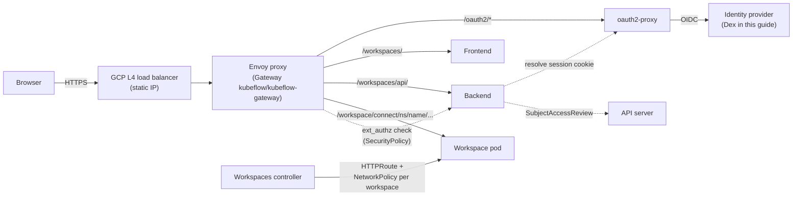

# Deploying Kubeflow Notebooks on GKE with Envoy Gateway

This guide deploys Kubeflow Notebooks v2 (workspaces controller, backend and frontend) on Google Kubernetes Engine **without Istio and without the rest of the Kubeflow distribution**. Routing and access control are provided by [Envoy Gateway](https://gateway.envoyproxy.io/), a Gateway API implementation, plus standard Kubernetes primitives (`NetworkPolicy`, RBAC, `SubjectAccessReview`).

It is a walk-through, not a reference: every step is run in order against a real cluster, and each one explains what it does and why it is needed. Values you must change for your environment are marked with `<angle brackets>`; values shown literally are the ones used in the walk-through.

> **Status.** This guide targets the `gateway_api` branch of [kubeflow/notebooks#1301](https://github.com/kubeflow/notebooks/pull/1301). Until that work is released, the controller, backend and frontend images must be built from that branch (see [Step 3](#step-3-build-and-publish-the-images)). Every step was run end to end on a GKE cluster in September 2026. The background and security analysis are in [design-gateway-api.md](design-gateway-api.md); what the deployment taught us about replacing Istio, and the alternatives that were evaluated, are in [istio-replacement-evaluation.md](istio-replacement-evaluation.md).
>
> Three objects in this guide are Envoy Gateway's own APIs rather than Gateway API: the `SecurityPolicy` that attaches the authorization check to the Gateway ([Step 9](#step-9-authentication-dex-and-oauth2-proxy)), the `BackendTrafficPolicy` that redirects anonymous browsers to the login page ([Step 10](#step-10-send-unauthenticated-visitors-to-the-login-page)), and the `EnvoyProxy` that requests the static IP ([Step 6](#step-6-create-the-gateway)). The first two are the security half of the deployment; see [Replacing the SecurityPolicy with the standard filter](#replacing-the-securitypolicy-with-the-standard-filter) before removing either.

## How the pieces fit



- **Envoy Gateway** programs Envoy from Gateway API resources. The controller creates one `HTTPRoute` per workspace; the backend and frontend ship their own.
- **Authorization at the edge.** Every request through the gateway is checked by Envoy's `ext_authz` filter against the backend's `/authz` endpoint. The backend resolves the caller's identity and, for workspace connect paths, runs a `SubjectAccessReview` for `get` on the target `Workspace`. A `200` lets the request through; anything else denies it.
- **Identity headers are set by the edge, as in Kubeflow.** On a `200` the check returns `kubeflow-userid` and `kubeflow-groups`, and Envoy writes them onto the request with overwrite semantics before it reaches the frontend, the backend or a workspace pod. This matters more than it looks: the backend trusts those headers when a request carries no session cookie or bearer token — exactly as it does behind Istio, where the ingress gateway rewrites them. The Gateway-wide `SecurityPolicy` is what makes that trust sound here. Attach the check to individual routes instead of the Gateway and the API becomes reachable with a client-typed header ([evaluation, finding F3](istio-replacement-evaluation.md#4-what-a-live-deployment-taught-us)).
- **Authentication** is an unmodified [oauth2-proxy](https://oauth2-proxy.github.io/oauth2-proxy/): it serves the login flow under `/oauth2/` and owns the session cookie. The backend never reads the cookie; it forwards it to oauth2-proxy's `/oauth2/auth` and consumes the resulting identity headers.
- **Reachability.** Each workspace pod gets a `NetworkPolicy` that only admits the gateway's Envoy pods, so nothing in the cluster can bypass the check by connecting to a workspace `Service` directly. GKE Dataplane V2 (Cilium) enforces it.
- **Authorization decisions** are plain Kubernetes RBAC: you bind the shipped `kubeflow-workspaces-{admin,edit,view}` ClusterRoles to users with ordinary `RoleBinding`s. No Profile controller is involved.

### A note on the `ExternalAuth` filter

The controller can emit the Gateway API `ExternalAuth` HTTPRoute filter ([GEP-1494](https://gateway-api.sigs.k8s.io/geps/gep-1494/)) on every workspace route. **Envoy Gateway does not implement that filter yet** — an HTTPRoute carrying it is marked `ResolvedRefs=False` and answers `500`. Envoy Gateway exposes the same Envoy `ext_authz` capability through its own [`SecurityPolicy`](https://gateway.envoyproxy.io/docs/tasks/security/ext-auth/) resource instead.

The wire contract is identical (Envoy's HTTP `ext_authz`, which the backend's `/authz` endpoint already speaks), so this guide:

- runs the controller with `EXTERNAL_AUTH_URL` **empty**, so workspace routes carry no `ExternalAuth` filter and the *standard* Gateway API channel is sufficient;
- attaches **one** `SecurityPolicy` to the Gateway, which applies `ext_authz` to every route — including the workspace routes the controller creates in tenant namespaces — with no per-namespace `ReferenceGrant`.

When Envoy Gateway ships the standard filter, the `SecurityPolicy` can be replaced by setting `EXTERNAL_AUTH_URL` back to its default — but not *only* that; see [Replacing the SecurityPolicy with the standard filter](#replacing-the-securitypolicy-with-the-standard-filter) for what else the Gateway-wide policy was doing.

## Prerequisites

On your workstation:

| Tool | Used for |
| :--- | :--- |
| `gcloud` | creating the cluster, static IP and image repository |
| `kubectl` | everything else |
| `helm` (v3) | installing cert-manager and Envoy Gateway |
| `docker` | building the images from the branch (temporary, see above) |

In Google Cloud, a project with the `container.googleapis.com` and `artifactregistry.googleapis.com` APIs enabled, and permission to create clusters, addresses and repositories in it.

```bash
export PROJECT=<your-project-id>
export REGION=us-central1
export ZONE=us-central1-c
export CLUSTER=kubeflow-notebooks
gcloud config set project "${PROJECT}"
```

## Step 1: Reserve a static IP

The gateway needs a stable public address: the OIDC issuer URL, the OAuth redirect URL and the session cookie are all bound to a hostname, and that hostname must resolve to the same IP for the browser and for the pods inside the cluster. Reserving the IP first lets you configure everything else before the load balancer exists.

```bash
gcloud compute addresses create kubeflow-gateway --region "${REGION}"
export GATEWAY_IP=$(gcloud compute addresses describe kubeflow-gateway --region "${REGION}" --format='value(address)')
echo "${GATEWAY_IP}"
```

The walk-through uses [sslip.io](https://sslip.io), a public wildcard DNS service that resolves `<anything>.<ip-with-dashes>.sslip.io` to the embedded IP, so no DNS zone is required:

```bash
export GATEWAY_HOST="kubeflow.$(echo "${GATEWAY_IP}" | tr . -).sslip.io"
echo "${GATEWAY_HOST}"        # e.g. kubeflow.104-154-156-199.sslip.io
```

If you own a domain, create an `A` record for it pointing at `${GATEWAY_IP}` and set `GATEWAY_HOST` to that name instead. Everything below uses the variable.

## Step 2: Create the cluster

```bash
gcloud container clusters create "${CLUSTER}" \
  --zone "${ZONE}" \
  --release-channel regular \
  --num-nodes 2 \
  --machine-type e2-standard-4 \
  --enable-dataplane-v2 \
  --enable-ip-alias \
  --workload-pool "${PROJECT}.svc.id.goog"
```

What the flags are for:

- `--enable-dataplane-v2` — GKE Dataplane V2 is Cilium, which **enforces `NetworkPolicy`** with no further configuration. This is a hard requirement: the per-workspace `NetworkPolicy` is the only thing preventing another tenant's notebook from reaching your workspace pod directly. On a cluster without Dataplane V2, add `--enable-network-policy` (Calico) instead; without either, the isolation described in this guide does not exist.
- `--enable-ip-alias` — VPC-native cluster; required by Dataplane V2.
- **No `--gateway-api` flag.** That flag installs the GKE Gateway controller and a GKE-managed copy of the Gateway API CRDs. We use Envoy Gateway, whose Helm chart installs the CRDs it needs; letting two components own the same CRDs is a recipe for version conflicts. If your cluster already has the GKE addon enabled, see [Clusters with the GKE Gateway addon](#clusters-with-the-gke-gateway-addon).
- `--workload-pool` — Workload Identity is not used by anything in this guide; it is enabled because it is the modern default and costs nothing.
- Sizing: two `e2-standard-4` nodes comfortably fit the platform components (Envoy Gateway, cert-manager, Dex, oauth2-proxy, the three notebooks components) plus a few small notebook pods. Scale the pool for real notebook workloads.

Fetch credentials once the cluster is `RUNNING`:

```bash
gcloud container clusters get-credentials "${CLUSTER}" --zone "${ZONE}"
kubectl get nodes
```

Two things worth confirming before going on. Dataplane V2 is running (`anetd` is GKE's Cilium agent):

```bash
kubectl -n kube-system get pods -l k8s-app=cilium
```

and no Gateway API CRDs are present yet, so Envoy Gateway will own them:

```bash
kubectl get crd | grep gateway.networking.k8s.io || echo "none, as expected"
```

## Step 3: Build and publish the images

> Temporary until the `gateway_api` branch is released. Once published images exist, skip to [Step 4](#step-4-install-cert-manager) and use them.

The manifests reference `ghcr.io/kubeflow/notebooks/workspaces-{controller,backend,frontend}`. Those images are built from upstream `notebooks-v2` and do not contain the Gateway API routing, the `/authz` endpoint or the session authenticator, so build your own from the branch and push them to Artifact Registry.

```bash
gcloud artifacts repositories create kubeflow-notebooks \
  --repository-format docker --location "${REGION}"
gcloud auth configure-docker "${REGION}-docker.pkg.dev"

export REGISTRY="${REGION}-docker.pkg.dev/${PROJECT}/kubeflow-notebooks"
export TAG=$(git rev-parse --short HEAD)     # tag images with the commit they were built from

cd workspaces/controller && docker build --tag "${REGISTRY}/workspaces-controller:${TAG}" . && cd -
cd workspaces/backend    && docker build --tag "${REGISTRY}/workspaces-backend:${TAG}" --file Dockerfile .. && cd -
cd workspaces/frontend   && docker build --tag "${REGISTRY}/workspaces-frontend:${TAG}" --build-arg DEPLOYMENT_MODE=standalone . && cd -

for c in controller backend frontend; do docker push "${REGISTRY}/workspaces-${c}:${TAG}"; done
```

Notes:

- **`--build-arg DEPLOYMENT_MODE=standalone` on the frontend is not optional.** The UI's deployment mode is compiled into the bundle. The default, `kubeflow`, produces a UI meant to be embedded in the Kubeflow Central Dashboard: it has no navigation bar and no namespace selector, and it expects the Dashboard's `centraldashboard` script to tell it which namespace is selected. Opened directly, it renders an empty shell that can never list anything. `standalone` builds the UI with its own navigation and a namespace selector fed by the backend's `/api/v1/namespaces`, which is exactly what this deployment needs. (This build argument is added by the `gateway_api` branch; the upstream Dockerfile always builds `kubeflow` mode.)
- The backend's build context is the parent `workspaces/` directory (`--file Dockerfile ..`), because its Dockerfile copies the controller module for the shared API types. Building it from `workspaces/backend` fails with `"/backend/openapi": not found`.
- Plain `docker build` produces an image for your workstation's architecture. GKE `e2` nodes are `amd64`; if you build on an Apple Silicon machine, add `--platform linux/amd64`, or use the `docker-build-push-multi-arch` targets in each component's Makefile.
- GKE nodes pull from Artifact Registry in the same project with their default service account and no extra configuration.

## Step 4: Install cert-manager

cert-manager is needed for two unrelated things: the controller's admission webhook certificate (the `certmanager` kustomize component), and the TLS certificate the Gateway serves.

```bash
helm repo add jetstack https://charts.jetstack.io --force-update
helm upgrade --install cert-manager jetstack/cert-manager \
  --namespace cert-manager --create-namespace \
  --version v1.20.2 \
  --set crds.enabled=true \
  --wait
```

`v1.20.2` is the version the repository's own scripts and e2e tests pin; any supported release works.

## Step 5: Install Envoy Gateway

```bash
helm upgrade --install eg oci://docker.io/envoyproxy/gateway-helm \
  --version v1.9.1 \
  --namespace envoy-gateway-system --create-namespace \
  --set config.envoyGateway.provider.kubernetes.deploy.type=GatewayNamespace \
  --wait
```

- The chart installs the Gateway API CRDs (`v1.6.1`, experimental channel, which is a superset of standard) together with Envoy Gateway's own CRDs. Check with `kubectl get crd | grep gateway.networking.k8s.io`.
- **`deploy.type=GatewayNamespace`** makes Envoy Gateway create the Envoy proxy `Deployment` and `Service` in the *Gateway's* namespace rather than in `envoy-gateway-system`. This is what lets the `NetworkPolicy` selector shipped with the notebooks manifests — `kubeflow:gateway.networking.k8s.io/gateway-name=kubeflow-gateway` — match the proxy pods without modification: the label is set by Envoy Gateway, and the namespace is the one we create the Gateway in. In the default mode the proxy pods live in `envoy-gateway-system` and you would set `WORKSPACE_NETWORK_POLICY_INGRESS` and the backend/frontend `NetworkPolicy` accordingly.

## Step 6: Create the Gateway

Everything in this step goes into the `kubeflow` namespace: the Gateway, its Envoy pods, the TLS certificate and later oauth2-proxy. The manifests below are templated on `GATEWAY_IP` and `GATEWAY_HOST`; render them with `envsubst`.

```bash
cat <<'EOF' > gateway.yaml
apiVersion: v1
kind: Namespace
metadata:
  name: kubeflow
---
apiVersion: gateway.networking.k8s.io/v1
kind: GatewayClass
metadata:
  name: eg
spec:
  controllerName: gateway.envoyproxy.io/gatewayclass-controller
---
apiVersion: cert-manager.io/v1
kind: ClusterIssuer
metadata:
  name: selfsigned-issuer
spec:
  selfSigned: {}
---
apiVersion: cert-manager.io/v1
kind: Certificate
metadata:
  name: gateway-tls
  namespace: kubeflow
spec:
  secretName: gateway-tls-secret
  duration: 8760h
  issuerRef:
    name: selfsigned-issuer
    kind: ClusterIssuer
  dnsNames:
    - ${GATEWAY_HOST}
---
# Data-plane settings for this Gateway. On GKE the static IP must be requested
# through Service.spec.loadBalancerIP: Gateway.spec.addresses maps to
# Service.spec.externalIPs, which GKE's admission control denies.
apiVersion: gateway.envoyproxy.io/v1alpha1
kind: EnvoyProxy
metadata:
  name: kubeflow-gateway
  namespace: kubeflow
spec:
  provider:
    type: Kubernetes
    kubernetes:
      envoyService:
        loadBalancerIP: ${GATEWAY_IP}
---
apiVersion: gateway.networking.k8s.io/v1
kind: Gateway
metadata:
  name: kubeflow-gateway
  namespace: kubeflow
spec:
  gatewayClassName: eg
  infrastructure:
    parametersRef:
      group: gateway.envoyproxy.io
      kind: EnvoyProxy
      name: kubeflow-gateway
  listeners:
    - name: https
      port: 443
      protocol: HTTPS
      hostname: ${GATEWAY_HOST}
      allowedRoutes:
        namespaces:
          from: All
      tls:
        mode: Terminate
        certificateRefs:
          - kind: Secret
            name: gateway-tls-secret
EOF

envsubst < gateway.yaml | kubectl apply -f -
kubectl -n kubeflow wait --for=condition=Ready certificate/gateway-tls --timeout=120s
kubectl -n kubeflow wait --for=condition=Programmed gateway/kubeflow-gateway --timeout=300s
kubectl -n kubeflow get gateway,svc,pods
```

Expected: the Gateway shows `PROGRAMMED True` with `ADDRESS` equal to your static IP, and a `LoadBalancer` Service named `kubeflow-gateway` with that IP as `EXTERNAL-IP`. The Envoy pod carries the label `gateway.networking.k8s.io/gateway-name=kubeflow-gateway`.

Why it is written this way:

- **The static IP goes in `EnvoyProxy.spec.provider.kubernetes.envoyService.loadBalancerIP`, not in `Gateway.spec.addresses`.** Envoy Gateway translates `Gateway.spec.addresses` into `Service.spec.externalIPs`, and GKE rejects that field (`Use of external IPs is denied by admission control`); the Gateway then sits at `Programmed=False, AddressNotUsable` with no Service created at all. `loadBalancerIP` is the field GKE's cloud controller honours for a reserved address.
- **`allowedRoutes.namespaces.from: All`** — the controller creates workspace `HTTPRoute`s in every tenant namespace; the listener must accept routes from all of them.
- **`hostname`** on the listener restricts the Gateway to the one name the certificate covers, so a request with another `Host` header is rejected rather than served under the wrong certificate.
- **Self-signed TLS** keeps the guide self-contained: browsers will warn and you will accept the certificate once. Two components need the CA explicitly and the guide handles both: oauth2-proxy (OIDC discovery against the issuer, [Step 9](#step-9-authentication-dex-and-oauth2-proxy)) and your own `curl` checks. For a real deployment use a real issuer with cert-manager — an ACME `ClusterIssuer` with the [Gateway API HTTP-01 solver](https://cert-manager.io/docs/usage/gateway/) needs only your domain — and everything else in this guide stays the same.

Two checks before moving on. From your workstation, TLS terminates at Envoy with our certificate and there are no routes yet, so Envoy answers `404`:

```bash
kubectl -n kubeflow get secret gateway-tls-secret -o jsonpath='{.data.ca\.crt}' | base64 -d > gateway-ca.crt
curl --cacert gateway-ca.crt -o /dev/null -w 'HTTP %{http_code}\n' "https://${GATEWAY_HOST}/"
```

From inside the cluster, the *public* hostname must also reach the Gateway, because oauth2-proxy will perform OIDC discovery against the issuer URL the browser sees:

```bash
kubectl run curl-probe --rm -it --restart=Never --image=curlimages/curl:8.11.0 -- \
  curl -sk -o /dev/null -w 'HTTP %{http_code}\n' "https://${GATEWAY_HOST}/"
```

On GKE Dataplane V2 this works out of the box: Cilium answers for the load balancer IP on the node, so the connection hairpins without leaving the VPC. (The local development environment needs a `hostAliases` patch for the same effect; here it is unnecessary.)

## Step 7: Deploy the notebooks components

The repository ships a `gateway-api` kustomize overlay for each component. Rather than editing them, this guide layers three small kustomizations on top — in [deploy/gke](deploy/gke) — that do exactly three things: point the images at your registry, blank out `EXTERNAL_AUTH_URL` on the controller, and tell the backend where oauth2-proxy is.

```bash
# deploy/gke/controller/kustomization.yaml
resources:
  - ../../../workspaces/controller/manifests/kustomize/overlays/gateway-api
images:
  - name: ghcr.io/kubeflow/notebooks/workspaces-controller
    newName: <REGISTRY>/workspaces-controller
    newTag: <TAG>
configMapGenerator:
  - name: kubeflow-workspaces-gateway-api-config
    namespace: kubeflow-workspaces
    behavior: merge
    literals:
      - EXTERNAL_AUTH_URL=          # see "A note on the ExternalAuth filter"
```

```bash
# deploy/gke/backend/kustomization.yaml (abridged)
resources:
  - ../../../workspaces/backend/manifests/kustomize/overlays/gateway-api
images: [...]
patches:
  - target: {kind: Deployment, name: workspaces-backend}
    patch: |-
      ... env:
            - name: SESSION_AUTH_URL
              value: http://oauth2-proxy.kubeflow.svc.cluster.local:4180/oauth2/auth
```

The frontend kustomization only overrides the image. Set your registry and tag in all three (`sed -i "s|<REGISTRY>|${REGISTRY}|; s|<TAG>|${TAG}|" deploy/gke/*/kustomization.yaml`), then build and apply, controller first — it owns the CRDs and the admission webhook the others depend on:

```bash
KUSTOMIZE=kubectl kustomize        # or a standalone kustomize >= v5

for c in controller backend frontend; do ${KUSTOMIZE} deploy/gke/${c} > ${c}.yaml; done

kubectl apply --server-side --force-conflicts -f controller.yaml
kubectl -n kubeflow-workspaces rollout status deploy/workspaces-controller
kubectl apply --server-side --force-conflicts -f backend.yaml -f frontend.yaml
kubectl -n kubeflow-workspaces rollout status deploy/workspaces-backend
kubectl -n kubeflow-workspaces rollout status deploy/workspaces-frontend
```

`--server-side` is used because the CRDs carry very large annotations that exceed the client-side `last-applied-configuration` limit.

What the overlays give you, and the values that matter:

| Setting | Value | Why |
| :--- | :--- | :--- |
| `GATEWAY_NAME` | `kubeflow/kubeflow-gateway` | Selects Gateway API routing and names the parent of every workspace `HTTPRoute`. |
| `GATEWAY_HOSTS` | `*` | Routes carry no `hostnames`; they inherit the listener's. |
| `EXTERNAL_AUTH_URL` | *(empty)* | No `ExternalAuth` filter on workspace routes; Envoy Gateway would reject it. Authorization is attached in [Step 9](#step-9-authentication-dex-and-oauth2-proxy). |
| `WORKSPACE_NETWORK_POLICY_INGRESS` | `kubeflow:gateway.networking.k8s.io/gateway-name=kubeflow-gateway` | Each workspace gets a `NetworkPolicy` admitting only the Envoy pods. Matches because of GatewayNamespace mode (Step 5). |
| `WORKSPACE_NETWORK_POLICY_SELF` | `kubeflow-workspaces:app=workspaces-controller` | The controller is admitted too: its Jupyter activity probe connects to the workspace pod directly, and idle culling stalls if the policy blocks it. Must match the controller's own namespace and labels. |
| backend `SESSION_AUTH_URL` | oauth2-proxy's `/oauth2/auth` | Turns browser session cookies into identities. |
| backend `ENABLE_TOKEN_AUTH` | `false` (default) | GKE's API server does not trust an OIDC issuer you run yourself, so `TokenReview` cannot validate Dex tokens. The backend uses the identity headers from oauth2-proxy's auth response instead, which is safe because that response comes from the backend's own outbound call, not from the client. |
| `NetworkPolicy` on backend/frontend | ingress only from the Envoy pods | Nothing else in the cluster can talk to them directly. |

Check the routes were accepted by Envoy Gateway:

```bash
kubectl -n kubeflow-workspaces get pods
kubectl -n kubeflow-workspaces get httproute -o jsonpath='{range .items[*]}{.metadata.name}: {range .status.parents[0].conditions[*]}{.type}={.status} {end}{"\n"}{end}'
```

Both routes must show `Accepted=True ResolvedRefs=True`.

## Step 8: Smoke test the edge

Nothing authenticates yet, so this is what you should see:

```bash
for p in /workspaces /workspaces/ /workspaces/api/v1/workspaces; do
  printf '%-32s ' "$p"; curl --cacert gateway-ca.crt -s -o /dev/null -w 'HTTP %{http_code}\n' "https://${GATEWAY_HOST}$p"
done
```

```text
/workspaces                      HTTP 301      # redirect to /workspaces/
/workspaces/                     HTTP 200      # the UI's index.html
/workspaces/api/v1/workspaces    HTTP 401      # the backend refuses a caller with no identity
```

The `401` is the backend doing its own authentication (`requireAuth` on every handler); it does not depend on anything at the gateway. The next step puts a login in front of all of it.

## Step 9: Authentication: Dex and oauth2-proxy

Two off-the-shelf components, both published through the same Gateway:

- **Dex** is the identity provider for the walk-through, with two static users. Any OIDC provider works in its place — see [Using another identity provider](#using-another-identity-provider) — and nothing in the notebooks components knows which one you use.
- **oauth2-proxy** is the relying party: it redirects to the provider, handles the callback and issues the encrypted session cookie. It is *not* in the data path; it only serves `/oauth2/*` and answers the backend's `/oauth2/auth` lookups.

The manifests are [deploy/gke/dex.yaml](deploy/gke/dex.yaml) and [deploy/gke/auth.yaml](deploy/gke/auth.yaml). Three secrets are generated first:

```bash
export OIDC_CLIENT_SECRET=$(head -c 32 /dev/urandom | base64 -w0)       # shared by Dex and oauth2-proxy
export COOKIE_SECRET=$(head -c 32 /dev/urandom | base64 -w0 | head -c 32) # oauth2-proxy needs exactly 16, 24 or 32 bytes
export DEX_PASSWORD_HASH=$(htpasswd -nbBC 10 x password | cut -d: -f2)   # bcrypt of the demo password "password"

kubectl create namespace dex
for ns in dex kubeflow; do
  kubectl -n "${ns}" create secret generic oidc-client --from-literal=client-secret="${OIDC_CLIENT_SECRET}"
done
kubectl -n kubeflow create secret generic oauth2-proxy --from-literal=cookie-secret="${COOKIE_SECRET}"

envsubst '$GATEWAY_HOST $DEX_PASSWORD_HASH' < deploy/gke/dex.yaml  | kubectl apply -f -
envsubst '$GATEWAY_HOST'                    < deploy/gke/auth.yaml | kubectl apply -f -
kubectl -n dex rollout status deploy/dex
kubectl -n kubeflow rollout status deploy/oauth2-proxy
```

(`htpasswd` is in the `apache2-utils` package; `python3 -c 'import bcrypt; ...'` or `docker run --rm --entrypoint htpasswd httpd:2.4-alpine -nbBC 10 x password` produce the same hash.)

What is in `auth.yaml`, and why:

**oauth2-proxy.** The arguments are the ones the repository's development environment uses, plus one:

| Argument | Why |
| :--- | :--- |
| `--oidc-issuer-url=https://${GATEWAY_HOST}/dex` | The *public* URL. It is embedded in every ID token, so browser and proxy must agree on it. |
| `--redirect-url=https://${GATEWAY_HOST}/oauth2/callback` | Must match a `redirectURIs` entry in Dex's static client. |
| `--reverse-proxy=true` | Requests arrive through Envoy; trust `X-Forwarded-*` when building redirects. |
| `--upstream=static://202` | oauth2-proxy insists on an upstream; nothing is proxied through it. |
| `--set-xauthrequest=true`, `--set-authorization-header=true` | Make `/oauth2/auth` return `X-Auth-Request-Email`/`-Groups` and the ID token. The backend consumes the former; the latter is what a `TokenReview`-capable cluster would validate. |
| `--approval-prompt=auto` | **Added for this guide.** oauth2-proxy's default (`force`) makes Dex show a consent screen on every login even with `skipApprovalScreen: true`. |
| `SSL_CERT_FILE=/etc/ssl/gateway/ca.crt` | OIDC discovery hits the issuer through the Gateway, which serves the self-signed certificate. The CA is mounted straight from the Gateway's certificate Secret (only the `ca.crt` key). Drop this with a publicly trusted certificate. |

**The `SecurityPolicy`.** This is the piece that replaces the `ExternalAuth` filter:

```yaml
apiVersion: gateway.envoyproxy.io/v1alpha1
kind: SecurityPolicy
metadata:
  name: workspaces-authz
  namespace: kubeflow
spec:
  targetRefs:
    - group: gateway.networking.k8s.io
      kind: Gateway
      name: kubeflow-gateway
  extAuth:
    http:
      backendRefs:
        - name: workspaces-backend
          namespace: kubeflow-workspaces
          port: 4000
      path: /authz
      headersToBackend: [kubeflow-userid, kubeflow-groups]
    headersToExtAuth: [cookie]
```

- Targeting the **Gateway** applies it to every route attached to it, including the workspace routes the controller will create in tenant namespaces. Nothing needs to be provisioned per namespace.
- `path: /authz` is *prepended* to the original request path, so the backend sees `/authz/workspace/connect/<ns>/<name>/...` — the same shape the standard filter produces.
- `headersToExtAuth: [cookie]` is essential: Envoy's HTTP `ext_authz` forwards only `Host`, `Method`, `Path`, `Content-Length` and `Authorization` by default, and the session cookie is the credential.
- `headersToBackend` copies the identity headers from the `200` response onto the upstream request, **overwriting** anything the client sent. This is what makes a spoofed `kubeflow-userid` header harmless.
- The cross-namespace `backendRefs` needs a `ReferenceGrant` in `kubeflow-workspaces` allowing `SecurityPolicy` from `kubeflow` to reference the Service; it is in the same file.

**Exemptions.** The login endpoints and Dex must be reachable without a session. A `SecurityPolicy` attached to an `HTTPRoute` takes precedence over the Gateway-level one for that route, so an *empty* policy on the `oauth2-proxy` and `dex` routes switches the check off there. Envoy Gateway reports this on the Gateway policy as `Overridden=True`:

```bash
kubectl get securitypolicy -A -o jsonpath='{range .items[*]}{.metadata.namespace}/{.metadata.name}: {range .status.ancestors[*]}{range .conditions[*]}{.type}={.status} {end}{end}{"\n"}{end}'
```

```text
dex/dex-public: Accepted=True
kubeflow/oauth2-proxy-public: Accepted=True
kubeflow/workspaces-authz: Accepted=True Overridden=True
```

### Verify

Without a session, the UI and API are now refused *at the gateway* (the body is the backend's `/authz` reply), while the login endpoints are open and a forged identity header changes nothing:

```bash
for p in /workspaces/ /workspaces/api/v1/workspaces /oauth2/start /dex/.well-known/openid-configuration; do
  printf '%-42s ' "$p"; curl --cacert gateway-ca.crt -s -o /dev/null -w 'HTTP %{http_code}\n' "https://${GATEWAY_HOST}$p"
done
curl --cacert gateway-ca.crt -s -o /dev/null -w 'spoofed header: HTTP %{http_code}\n' \
  -H 'kubeflow-userid: admin@example.com' "https://${GATEWAY_HOST}/workspaces/api/v1/workspaces"
```

```text
/workspaces/                               HTTP 401
/workspaces/api/v1/workspaces              HTTP 401
/oauth2/start                              HTTP 302      # to Dex
/dex/.well-known/openid-configuration      HTTP 200
spoofed header: HTTP 401
```

Now log in. In a browser, open `https://${GATEWAY_HOST}/oauth2/start?rd=/workspaces/`, accept the self-signed certificate, and sign in as `user@example.com` / `password`; you land on the workspaces UI. The same flow can be scripted for checks from a terminal: [deploy/gke/login.sh](deploy/gke/login.sh) drives Dex's login form with `curl` and keeps the session cookie in a jar.

```bash
curl --cacert gateway-ca.crt -s -o /dev/null -w 'HTTP %{http_code}\n' \
  "https://${GATEWAY_HOST}/workspaces/api/v1/namespaces"          # 401: no session yet
deploy/gke/login.sh "${GATEWAY_HOST}" gateway-ca.crt user@example.com password user.jar
curl --cacert gateway-ca.crt -s -b user.jar "https://${GATEWAY_HOST}/workspaces/api/v1/namespaces"
```

```text
{"data":[]}
```

A `200` with an empty list is the expected result at this point: the caller is authenticated as `user@example.com` (Envoy's check passed, the backend resolved the cookie through oauth2-proxy), and the backend's per-namespace `SubjectAccessReview` found no namespace in which that user may act. The next step fixes that with RBAC.

## Step 10: Send unauthenticated visitors to the login page

Without this step, opening `https://${GATEWAY_HOST}/workspaces/` in a browser with no session shows a bare `401` — correct, but unfriendly. [deploy/gke/login-redirect.yaml](deploy/gke/login-redirect.yaml) attaches a `BackendTrafficPolicy` to the **UI route only** that turns Envoy-generated `401`s into the login flow:

```yaml
apiVersion: gateway.envoyproxy.io/v1alpha1
kind: BackendTrafficPolicy
metadata:
  name: workspaces-frontend-login-redirect
  namespace: kubeflow-workspaces
spec:
  targetRefs:
    - {group: gateway.networking.k8s.io, kind: HTTPRoute, name: workspaces-frontend}
  responseOverride:
    - match:
        statusCodes: [{type: Value, value: 401}]
      source: Local            # only Envoy-generated responses, i.e. the ext_authz denial
      redirect:
        path: {type: ReplaceFullPath, replaceFullPath: /oauth2/start?rd=%2Fworkspaces%2F}
        statusCode: 302
```

```bash
kubectl apply -f deploy/gke/login-redirect.yaml
```

- Scoped to the frontend route on purpose: API calls from the single-page app keep receiving `401` (which it can act on) rather than an HTML login page, and workspace connect URLs keep their precise `401`/`403` semantics.
- `source: Local` restricts the override to responses Envoy generated itself; a `401` coming from an upstream is left alone.
- Envoy implements this by fetching `/oauth2/start?rd=/workspaces/` internally and returning *that* response, so the browser receives oauth2-proxy's redirect to the identity provider — with its CSRF cookie — in a single hop.

```bash
curl --cacert gateway-ca.crt -s -o /dev/null -w 'HTTP %{http_code} -> %{redirect_url}\n' "https://${GATEWAY_HOST}/workspaces/"
# HTTP 302 -> https://<GATEWAY_HOST>/dex/auth?...&state=...%2Fworkspaces%2F
```

Open `https://${GATEWAY_HOST}/workspaces/` in a browser: you are taken to the Dex login form, and after signing in you land back on the UI.

## Step 11: Provision a tenant namespace

This is the step the Kubeflow Profile controller used to do, and it turns out to be ordinary Kubernetes administration: a `Namespace` and `RoleBinding`s. Nothing is configured at the gateway per tenant. [deploy/gke/tenant-team-a.yaml](deploy/gke/tenant-team-a.yaml):

```yaml
apiVersion: v1
kind: Namespace
metadata:
  name: team-a
---
apiVersion: rbac.authorization.k8s.io/v1
kind: RoleBinding
metadata:
  name: user-workspaces-edit
  namespace: team-a
subjects:
  - {kind: User, name: user@example.com, apiGroup: rbac.authorization.k8s.io}
roleRef:
  kind: ClusterRole
  name: kubeflow-workspaces-edit
  apiGroup: rbac.authorization.k8s.io
```

plus a small `Role` granting `get/list/watch` on `persistentvolumeclaims` and `secrets`, which the UI needs to offer volumes and secrets to attach.

```bash
kubectl apply -f deploy/gke/tenant-team-a.yaml
```

- The **user name is the email Dex puts in the ID token**, exactly as oauth2-proxy reports it in `X-Auth-Request-Email`. That is the string the backend hands to `SubjectAccessReview`, so it is the string RBAC must name. With another identity provider, use whatever it emits as the email claim.
- `kubeflow-workspaces-{admin,edit,view}` are `ClusterRole`s installed with the controller (Step 7). `view` is enough to connect to a workspace: the connect check asks for `get` on the `Workspace`.
- No `default-editor` ServiceAccount is needed. The controller creates a `ws-<workspace-name>` ServiceAccount per Workspace and, if the `WorkspaceKind` lists `serviceAccount.clusterRoles`, the RoleBindings for it.

Deploy the sample `WorkspaceKind`s and a sample `Workspace` into the namespace:

```bash
kubectl kustomize workspaces/controller/manifests/kustomize/samples | kubectl apply -n team-a -f -
kubectl -n team-a get workspace,pods,httproute,networkpolicy
```

After the image pull (`jupyter-scipy` is large) you should see:

```text
workspace.kubeflow.org/jupyterlab-workspace   Running   jupyterlab   jupyter-scipy:v1.10.0   tiny_cpu
pod/ws-jupyterlab-workspace-xxxxx-0           1/1     Running
httproute.gateway.networking.k8s.io/ws-jupyterlab-workspace-xxxxx
networkpolicy.networking.k8s.io/ws-jupyterlab-workspace-xxxxx
```

The `HTTPRoute` matches `/workspace/connect/team-a/jupyterlab-workspace/jupyterlab/` and carries a single `URLRewrite` filter; the `NetworkPolicy` admits two peers — the Envoy pods (`gateway.networking.k8s.io/gateway-name=kubeflow-gateway` in `kubeflow`) and the controller (`app=workspaces-controller` in `kubeflow-workspaces`). The sample PVCs use the cluster's default `StorageClass` (`standard-rwo` on GKE).

Idle culling depends on that second peer. The sample `WorkspaceKind` probes JupyterLab's `/api/status` from the controller to decide whether a workspace is idle; a probe that cannot connect never counts as activity, so workspaces would never be paused. Confirm the probe works:

```bash
kubectl -n team-a get workspace jupyterlab-workspace -o jsonpath='{.status.activity.lastProbe.result}: {.status.activity.lastProbe.message}{"\n"}'
# Success: Jupyter probe succeeded
```

> **Known issue.** On a cluster with real API latency the controller can create the Service, NetworkPolicy (and, on the Istio path, VirtualService) twice for a new Workspace, leaving it in `Error: Workspace owns multiple Services`. The cause is a `generateName` create followed by a cache-backed list on the next reconcile, which is cheaper to hit on GKE than on kind. Workaround until fixed: delete the newer duplicate — `kubectl -n team-a get svc,networkpolicy -l notebooks.kubeflow.org/workspace-name=<name> --sort-by=.metadata.creationTimestamp` and delete all but the first of each kind; the Workspace recovers on its own.

## Step 12: Verify the security model

These checks are the point of the whole exercise. `WS` is the connect path of the sample workspace; the cookie jars come from logging in as `user@example.com` (bound in `team-a`) and `admin@example.com` (authenticated, but bound nowhere).

```bash
WS=/workspace/connect/team-a/jupyterlab-workspace/jupyterlab/
curl --cacert gateway-ca.crt -s -o /dev/null -w 'anonymous:                 HTTP %{http_code}\n' "https://${GATEWAY_HOST}${WS}"
curl --cacert gateway-ca.crt -s -o /dev/null -w 'anonymous, forged header:  HTTP %{http_code}\n' -H 'kubeflow-userid: user@example.com' "https://${GATEWAY_HOST}${WS}"
curl --cacert gateway-ca.crt -s -o /dev/null -w 'admin (no RBAC in team-a): HTTP %{http_code}\n' -b admin.jar "https://${GATEWAY_HOST}${WS}"
curl --cacert gateway-ca.crt -s -L -o lab.html -w 'user (edit in team-a):     HTTP %{http_code}\n' -b user.jar -c user.jar "https://${GATEWAY_HOST}${WS}" && grep -o '<title>[^<]*</title>' lab.html
```

```text
anonymous:                 HTTP 401
anonymous, forged header:  HTTP 401
admin (no RBAC in team-a): HTTP 403
user (edit in team-a):     HTTP 200
<title>JupyterLab</title>
```

Reading the results:

- `401` — Envoy asked the backend, the backend found no session, denied. The forged `kubeflow-userid` header is irrelevant: the backend does not read identity from client headers when the check comes through the gateway, and `headersToBackend` would overwrite it anyway.
- `403` — `admin@example.com` is a real, authenticated user, but the `SubjectAccessReview` for `get workspaces/jupyterlab-workspace` in `team-a` came back denied. This is the per-namespace `AuthorizationPolicy` that the Kubeflow Profile controller used to write, replaced by RBAC the administrator already owns.
- `200` — the authorised user reaches JupyterLab through the gateway, with Envoy adding `kubeflow-userid: user@example.com` to the proxied request.

The API behaves consistently — `user` sees the namespace and its workspace, `admin` sees neither:

```bash
curl --cacert gateway-ca.crt -s -b user.jar "https://${GATEWAY_HOST}/workspaces/api/v1/namespaces"
# {"data":[{"name":"team-a"}]}
```

Finally, the reachability control. A pod in *another* namespace tries to connect to the workspace Service directly, bypassing the gateway and its check:

```bash
SVC=$(kubectl -n team-a get svc -l notebooks.kubeflow.org/workspace-name=jupyterlab-workspace -o jsonpath='{.items[0].metadata.name}')
kubectl create namespace team-b
kubectl -n team-b run probe --rm -it --restart=Never --image=curlimages/curl:8.11.0 -- \
  curl -s -o /dev/null -w 'HTTP %{http_code}\n' --max-time 8 "http://${SVC}.team-a.svc:8888/"
# HTTP 000   (timeout: the connection is dropped by the NetworkPolicy)
```

Without the per-workspace `NetworkPolicy` this request would have returned JupyterLab's login-free UI to any pod in the cluster.

## Step 13: Use it from a browser

The Gateway serves a self-signed certificate, so the browser must be told to trust it once. Either click through the warning on the first visit (Chrome: type `thisisunsafe` on the interstitial), or import `gateway-ca.crt` as a trusted authority — on Linux for Chrome/Chromium:

```bash
certutil -d sql:$HOME/.pki/nssdb -A -t "C,," -n kubeflow-gateway-ca -i gateway-ca.crt
```

Then open `https://${GATEWAY_HOST}/workspaces/`. What happens, in order:

1. The gateway's authorization check finds no session and, because of Step 10, redirects you to Dex's login form.
2. Sign in as `user@example.com` / `password`. Dex redirects to oauth2-proxy's callback, which sets the session cookie and sends you back to `/workspaces/`.
3. The UI loads, immediately navigates to its default route `/workspaces/workspaces`, and calls `GET /workspaces/api/v1/namespaces`. The namespace selector in the header fills with `team-a` — the one namespace `user@example.com` is bound in — and the workspace list shows `jupyterlab-workspace` as `Running`.
4. **Connect** opens `/workspace/connect/team-a/jupyterlab-workspace/jupyterlab/` in a new tab: the gateway asks the backend, the backend confirms `get` on that `Workspace`, and JupyterLab appears.

To see the other side of the model, open a private window and sign in as `admin@example.com` / `password`: the login succeeds, but the namespace selector is empty and the workspace list stays empty — that user is authenticated and bound nowhere. Pasting the connect URL yields `403`.

Two cosmetic things you will notice in the standalone UI are pre-existing and unrelated to this deployment: the user menu says `kubeflow-user` (the UI does not yet ask the backend who is logged in; it calls a `/api/v1/user` endpoint that does not exist and falls back to a placeholder), and the **Last activity** column reads `unknown` until the first successful activity probe.

## What you have

| Concern | Provided by |
| :--- | :--- |
| Ingress, TLS, routing | Envoy Gateway (Gateway API), cert-manager |
| Login, sessions | oauth2-proxy + any OIDC provider |
| Who may open which workspace | Backend `/authz` → `SubjectAccessReview` → your `RoleBinding`s |
| Attaching the check to routes | One Envoy Gateway `SecurityPolicy` on the Gateway |
| Nothing bypasses the gateway | Per-workspace `NetworkPolicy`, enforced by GKE Dataplane V2 |
| Tenant provisioning | `Namespace` + `RoleBinding` |

Components that are **not** installed: Istio, the Kubeflow Profile controller, KFAM, the Central Dashboard.

## Variations

### Using another identity provider

Only oauth2-proxy and RBAC know about the provider. To use Google accounts on GKE, create an OAuth 2.0 client (web application) in the Cloud Console with `https://${GATEWAY_HOST}/oauth2/callback` as an authorised redirect URI, then in `auth.yaml` replace the provider arguments:

```yaml
- --provider=google
- --client-id=<client id>.apps.googleusercontent.com
- --email-domain=<your-domain.com>     # or * to allow any Google account
```

and put the client secret in the `oidc-client` Secret. Drop the `SSL_CERT_FILE` variable and the CA volume (Google's endpoints have public certificates), skip `dex.yaml` entirely, and write `RoleBinding`s for the users' Google email addresses. Any other OIDC provider is the same exercise with `--provider=oidc --oidc-issuer-url=...`.

### Clusters with the GKE Gateway addon

If the cluster was created with `--gateway-api=standard`, GKE manages the Gateway API CRDs (standard channel) and runs its own controller for the `gke-l7-*` GatewayClasses. Envoy Gateway can coexist with it, following its [provider-managed CRDs procedure](https://gateway.envoyproxy.io/v1.9/install/install-helm/#clusters-with-compatible-provider-managed-gateway-api-crds): check the GKE-installed bundle version is one the Envoy Gateway release supports, install only Envoy Gateway's own CRDs, then install the chart without CRDs:

```bash
kubectl get crd gateways.gateway.networking.k8s.io -o jsonpath='{.metadata.annotations.gateway\.networking\.k8s\.io/bundle-version}'
helm template eg-crds oci://docker.io/envoyproxy/gateway-crds-helm --version v1.9.1 \
  --set crds.gatewayAPI.enabled=false --set crds.envoyGateway.enabled=true | kubectl apply --server-side -f -
helm upgrade --install eg oci://docker.io/envoyproxy/gateway-helm --version v1.9.1 \
  --namespace envoy-gateway-system --create-namespace \
  --set crds.enabled=false \
  --set config.envoyGateway.provider.kubernetes.deploy.type=GatewayNamespace
```

Everything from Step 6 on is unchanged; this guide only uses standard-channel resources. Using the GKE Gateway controller *itself* is not an option: it does not implement `ext_authz`.

### Replacing the SecurityPolicy with the standard filter

The `ExternalAuth` HTTPRoute filter is what this branch's controller emits when `EXTERNAL_AUTH_URL` is set. Envoy Gateway v1.9.1 does not implement it; [NGINX Gateway Fabric](https://docs.nginx.com/nginx-gateway-fabric/) v2.7.0 does (experimental channel CRDs, `nginxGateway.gwAPIExperimentalFeatures.enable=true`). The switch was started on the cluster this guide was written against and stopped once the following became clear; it is recorded in detail in [istio-replacement-evaluation.md](istio-replacement-evaluation.md), routes R2–R5. In short, a Gateway-attached `SecurityPolicy` does four things that a route filter does not do by itself:

1. **It covers every route.** A filter must be present on the frontend and backend routes too, not only the workspace routes the controller creates — otherwise the API accepts a client-typed `kubeflow-userid` (finding F3). The component overlays would need to carry it.
2. **It fails closed for routes without it.** With route-level filters, a workspace route published without one is a public notebook (finding F2). Never run the controller with `EXTERNAL_AUTH_URL` empty on a Gateway that has no Gateway-wide policy.
3. **It needs no per-tenant `ReferenceGrant`.** The filter's cross-namespace `backendRef` needs one `from` entry per tenant namespace in the `kubeflow-workspaces` grant (finding F8).
4. **It carries the cookie and the identity headers.** The standard filter forwards only `Host`, `Method`, `Path`, `Content-Length` and `Authorization` unless `allowedHeaders` lists `Cookie`, and NGINX copies response headers to the pod only if `allowedResponseHeaders` lists them (finding F7).

And two things nginx cannot do at all: forward a `302` from the check to the browser (the `auth_request` module renders its own `401`/`403` and turns any other status into `500`), so [Step 10](#step-10-send-unauthenticated-visitors-to-the-login-page) has no equivalent and anonymous browsers see a `401` page; and append the original path to the check URL — it sends it in a `Path` header instead, which the backend on this branch accepts.

If you take that path anyway: two-step static IP (create the Gateway, read `status.addresses`, `gcloud compute addresses create ... --addresses <ip>`), hostname and certificate derived *after* the Gateway exists, `EXTERNAL_AUTH_URL` at its default, one `ReferenceGrant` entry per tenant, and accept the missing redirect.

### Using the GKE Gateway controller with Identity-Aware Proxy

The GKE Gateway controller (`gke-l7-*` GatewayClasses) implements neither `ext_authz` nor the standard filter, so it cannot run this deployment as written. What it offers instead is [IAP](https://cloud.google.com/iap/docs/enabling-kubernetes-howto) on each backend Service (`GCPBackendPolicy`): Google handles login and issues a signed `x-goog-iap-jwt-assertion` the application verifies. That is a stronger identity model than any header-based one, and it would leave the upstream project untouched behind a small adapter — but the adapter is a separate design, not a variation of this guide. It is evaluated as route R7 in [istio-replacement-evaluation.md](istio-replacement-evaluation.md).

## Troubleshooting

| Symptom | Cause / fix |
| :--- | :--- |
| The UI loads but shows no navigation bar, the namespace selector is missing or reads `Select a value`, and the workspace list stays empty | The frontend image was built in `kubeflow` mode (the Dockerfile default) and is waiting for the Central Dashboard to tell it the namespace. Rebuild with `--build-arg DEPLOYMENT_MODE=standalone` (Step 3). |
| Workspaces are never paused; `status.activity.lastProbe` says `Jupyter probe failed: timeout` | The per-workspace `NetworkPolicy` is blocking the controller's probe. Check `WORKSPACE_NETWORK_POLICY_SELF` names the controller's namespace and labels (Step 7). |
| Gateway `Programmed=False`, reason `AddressNotUsable`, no Service created | The static IP was put in `Gateway.spec.addresses`; GKE denies `externalIPs`. Use `EnvoyProxy ... envoyService.loadBalancerIP` (Step 6). |
| `HTTPRoute ... invalid: When using URLRewrite filter with path.replacePrefixMatch, exactly one PathPrefix match must be specified` | Gateway API CEL validation. Split the rule so the `ReplacePrefixMatch` rule has one `PathPrefix` match. |
| Workspace route `ResolvedRefs=False`, requests answer `500` | The route carries an `ExternalAuth` filter Envoy Gateway does not support. Check `EXTERNAL_AUTH_URL` is empty on the controller. |
| Everything answers `401` even after logging in | Envoy is not forwarding the cookie to the check. `headersToExtAuth` must include `cookie`. |
| Login loops back to Dex's "Grant Access" screen | oauth2-proxy's default `--approval-prompt=force`; set `auto`. |
| oauth2-proxy `CrashLoopBackOff`, log mentions `x509: certificate signed by unknown authority` | It cannot verify the Gateway's certificate during OIDC discovery. Check the `SSL_CERT_FILE` mount, or that the public hostname is reachable from inside the cluster. |
| Authenticated user gets `403` on a workspace they should see | `kubectl auth can-i get workspaces/<name> -n <ns> --as <email>` — the email must match the RoleBinding subject exactly. |
| `curl -H 'kubeflow-userid: <someone>' .../workspaces/api/v1/...` answers `200` without a session | The authorization check is not covering the backend route: `SecurityPolicy/workspaces-authz` must target the **Gateway**, not individual routes, and no route-level `SecurityPolicy` other than the two login exemptions may exist. |
| Workspace `Error: Workspace owns multiple Services` | See the known issue in Step 11. |

## Cleaning up

```bash
gcloud container clusters delete "${CLUSTER}" --zone "${ZONE}" --quiet
gcloud compute addresses delete kubeflow-gateway --region "${REGION}" --quiet
gcloud artifacts repositories delete kubeflow-notebooks --location "${REGION}" --quiet
```

Deleting the cluster removes the load balancer with it; the static address and the image repository are billed separately until deleted.
